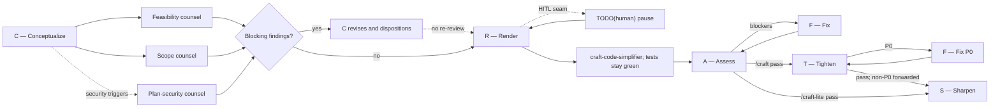

# Agent Utilities

A distributable CRAFTS toolkit for AI coding agents. It mirrors the current global `~/.agents` CRAFTS workflow and its role agents, including bundled security review guidance.



## Contents

```text
skills/
├── craft/                    # Autonomous CRAFTS workflow
├── craft-hitl/               # CRAFTS with a TODO(human) Render seam
├── craft-lite/               # CRAFTS without T
├── guided-tour/              # One-concept-at-a-time codebase teaching
└── security-and-hardening/   # Threat modeling and on-demand security references

agents/
├── craft-planner.md          # C — Conceptualize
├── craft-builder.md          # R/F — Render and Fix
├── craft-code-simplifier.md  # R-exit simplify gate
├── craft-evaluator.md        # A — Assess
├── craft-plan-security.md    # Pre-implementation security counsel lens
├── craft-security-review.md  # T — Tighten final-diff review (P0 gate)
├── craft-sharpener.md        # S — Sharpen
├── craft-plan-feasibility.md # Plan counsel: executable here & internally consistent
└── craft-plan-scope.md       # Plan counsel: exactly the criteria, no more
```

## CRAFTS at a glance

CRAFTS is a sequential delivery workflow:

`C → R → A → F → T → S`

| Phase | Role | Purpose |
| --- | --- | --- |
| **C**onceptualize | `craft-planner` | Scope, acceptance criteria, tests, plan, and security triggers |
| *Plan counsel* | `craft-plan-feasibility` · `craft-plan-scope` (+ `craft-plan-security` when triggered) | Independent one-pass review of the C plan before Render |
| **R**ender | `craft-builder` then `craft-code-simplifier` | Test-first implementation, then required simplify exit gate |
| **A**ssess | `craft-evaluator` | Independent review of implementation and tests |
| **F**ix | `craft-builder` | Minimal fixes for blocking findings |
| **T**ighten | `craft-security-review` | Bundled final-diff security review; only P0 findings block |
| **S**harpen | `craft-sharpener` | Durable documentation and process learning |

| Command | Path | When |
| --- | --- | --- |
| `/craft` | `C → counsel → R → A → F → T → S` | Default. No short path. |
| `/craft-hitl` | Same as `/craft`, HITL Render | A `TODO(human)` seam is reserved. |
| `/craft-lite` | `C → counsel → R → A → F → S` | Tighten is out of scope (prototype, spike). |

Every protocol runs the R-exit `craft-code-simplifier` gate after Render is green (tests must stay green; unrecoverable simplify is reverted). `/craft-lite` only skips Tighten and uses `--mode lite`.

### Plan counsel gate and security triggers

C emits `security_triggers` from a closed vocabulary (`trust-boundary-change`, `untrusted-input`, `authentication-authorization`, `secrets-sensitive-data`, `external-integration`, `file-command-execution`, `ci-deploy-permissions`, `tenant-isolation`) instead of a subjective risk score; an empty list means low-risk work.

Every task then runs the **plan counsel gate** between C and R:

1. The C report goes verbatim to independent read-only reviewers: feasibility-and-coherence and scope guardian always; security only when a trigger is declared. They may run in parallel; none sees another's findings first.
2. Any blocking finding returns all reports to C, which revises once and dispositions every blocking finding: `adopted` (with the plan change) or `rejected` (with rationale).
3. Render begins only when every blocking finding has a disposition — dispositions are the gate, not agreement. There is no counsel re-review round.
4. Feasibility reports `probe_required` instead of guessing when an assumption needs execution to settle; the user supplies evidence, descopes, or confirms.
5. Counsel reports and dispositions forward to Assess, which treats thin rejections or cosmetic adoptions as blocking findings.

Tighten maps every declared trust boundary to evidence, a P0 finding, or explicit non-applicability. It returns only P0 findings as blockers; Sharpen selects the project's existing memory sink for all non-P0 findings and the conductor records them. Security agents carry bundled review guidance with no external skill dependency. Role reports require named semantic fields; JSON is optional unless the host enforces a schema.

## Installation

Copy the directories into either a project's `.agents/` folder or your global `~/.agents/` folder:

```bash
# From this repository
cp -R skills/* /path/to/project/.agents/skills/
cp -R agents/* /path/to/project/.agents/agents/
```

Then invoke `/craft`, `/craft-hitl`, or `/craft-lite`. Ensure the host supports the agent frontmatter and bundled security-review guidance.

### Author-machine live install (symlinks)

On the author's machine, the listed entries under `~/.agents` point at this repository so the global workflow always matches git — one copy, no sync step:

```bash
for f in craft-builder craft-code-simplifier craft-evaluator craft-planner craft-plan-security craft-security-review craft-sharpener craft-plan-feasibility craft-plan-scope; do
  ln -sf ~/Projects/agent-utilities/agents/$f.md ~/.agents/agents/$f.md
done
for skill in craft craft-hitl craft-lite guided-tour security-and-hardening; do
  ln -sfn ~/Projects/agent-utilities/skills/$skill ~/.agents/skills/$skill
done
```

Edits through these links change the repository files; commit from this repository.

## Model routing

Agent frontmatter intentionally sets **no `model`** — in pi, frontmatter outranks `agentOverrides`, so a baked-in value would shadow each host's routing. Route per host via `subagents.agentOverrides` (or your harness's equivalent). The intended tiering:

| Role | Tier | Author-machine pin |
| --- | --- | --- |
| C — planner | heavy | `openai-codex/gpt-5.6-sol` |
| Counsel: feasibility | medium | `zai/glm-5.2` |
| Counsel: scope | light | `xai/grok-4.3` |
| Counsel: security (plan mode) | medium, different family from planner | `zai/glm-5.3` |
| R/F — builder | medium, different family from evaluator | `zai/glm-5.2` |
| R-exit — `craft-code-simplifier` | medium, different family from builder | host default |
| A — evaluator | heavy, different family from builder | `xai/grok-4.6` |
| T — tighten | medium, different family from builder | `openai-codex/gpt-5.6-terra` |
| S — sharpener | light | `openai-codex/gpt-5.6-luna` |

Give every pin a `fallbackModels` chain (rate-limit and overload errors walk it automatically); keeping subscription-capped providers out of primary positions and fallback-only models in the chain degrades gracefully instead of failing the phase.

## Design principles

- **Acceptance criteria remain the reference.** Assess reviews the test suite against the canonical criteria—provided verbatim or C-authored when absent—not just passing tests.
- **Independent review reduces correlated blind spots.** Builders do not approve their own work; plan counsel challenges the plan before code exists, and elevated plan review is independent of planning and implementation.
- **Security starts in planning.** Threat boundaries and abuse cases are considered before code exists, then rechecked against the final diff.
- **Knowledge compounds.** Sharpen records durable lessons without turning ordinary fixes into documentation churn.
- **Humans own consequential judgment.** HITL reserves explicit seams for people while the agent handles surrounding implementation and verification.

## License

MIT
