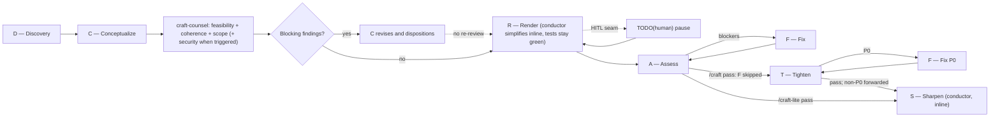
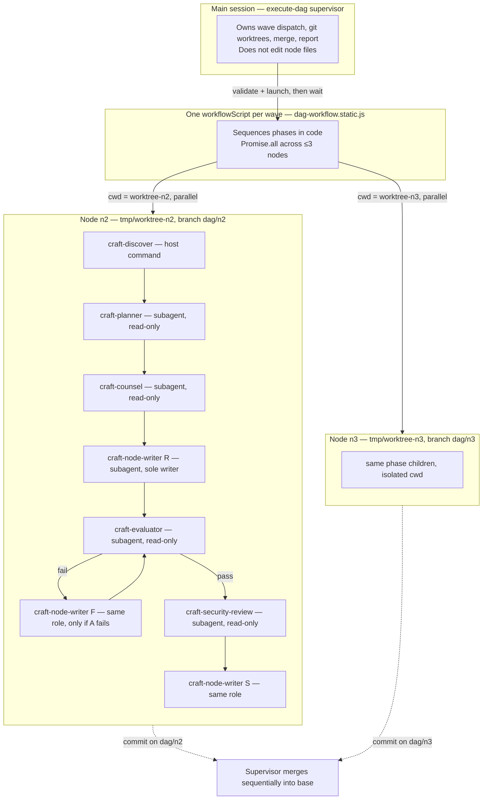
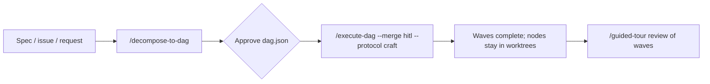

# CRAFTS

A sequential phase-gate workflow for AI coding agents: `D → C → counsel → R → A → [F] → T → S`, with a DAG layer for multi-node work.



## Contents

- [Install](#install)
- [CRAFTS at a glance](#crafts-at-a-glance)
- [DAG workflow](#dag-workflow)
- [Design principles](#design-principles)
- [Typical flow](#typical-flow)
- [Skills](#skills)
- [Measurement and tooling](#measurement-and-tooling)
- [Companion tooling](#companion-tooling)

## Install

Copy the skills and agents into a project's `.agents/` folder:

```bash
cp -R skills/* /path/to/project/.agents/skills/
cp -R agents/* /path/to/project/.agents/agents/
```

The metrics and mutation commands live in `tooling/`, along with both host adapters: the Pi extension is installed with `pi install /path/to/crafts/tooling`, and the Claude Code adapter is a set of hooks registered with `tooling/bin/craft-hooks-install.mjs ~/.claude/settings.json`. Invoke `/craft`, `/craft-hitl`, or `/craft-lite`. `/execute-dag` requires a subagent runtime with scripted orchestration (Pi's `workflowScript`/`runs.run`).

```text
skills/
├── craft/                    # Autonomous CRAFTS workflow
├── craft-hitl/               # CRAFTS with a TODO(human) Render seam
├── craft-lite/               # CRAFTS without T
├── decompose-to-dag/         # Spec → validated dag.json artifact
├── execute-dag/              # Supervised DAG execution (wave barrier)
└── guided-tour/              # One-concept-at-a-time codebase teaching

agents/
├── craft-planner.md          # C — Conceptualize
├── craft-counsel.md          # Plan counsel: feasibility, coherence, scope (+ security when triggered)
├── craft-builder.md          # R/F — Render and Fix
├── craft-code-simplifier.md  # Standalone simplify pass (not spawned by CRAFTS — Render does this inline)
├── craft-evaluator.md        # A — Assess
├── craft-security-review.md  # T — Tighten final-diff review (P0 gate)
└── craft-node-writer.md      # Sole writer for one DAG node worktree

tooling/                      # Metrics, mutation, Discovery, routing
├── bin/craft-discover.mjs    # Deterministic evidence packet
├── bin/craft-delta.mjs       # Post-Render change artifact
├── bin/craft-routes.mjs      # Pi role fallback installer
├── bin/craft-metrics.mjs     # Phase-grained collector
├── extensions/pi.ts          # Pi host adapter
├── extensions/claude-code.ts # Claude Code host adapter (hooks)
└── package.json

CHANGELOG.md                  # Protocol and toolkit history
```

## CRAFTS at a glance

| Phase | Role | Purpose |
| --- | --- | --- |
| **D**iscovery | `craft-discover` (conductor, no spawn) | Read-only evidence packet: authority, task sources, graph freshness; no planning or scope |
| **C**onceptualize | `craft-planner` | Scope, acceptance criteria, tests, plan, and security triggers |
| *Plan counsel* | `craft-counsel` (single reviewer, different model family from C) | Independent one-pass review of the C plan before Render: feasibility, coherence, scope, and security when triggered |
| **R**ender | `craft-builder` | Test-first implementation, a required inline simplify pass (conductor, no spawn), and a decision record of choices the plan did not dictate |
| **A**ssess | `craft-evaluator` (different model family from R, blinded) | Judges what an exit code cannot: do tests encode the criteria, were they weakened to pass, is the implementation sound |
| **F**ix | `craft-builder` | Minimal fixes for blocking findings. **Conditional** — skipped entirely when A passes clean |
| **T**ighten | `craft-security-review` (different model family from R) | Bundled final-diff security review; only P0 findings block |
| **S**harpen | conductor (inline, no spawn) | Durable documentation and process learning |

Protocol version **5**. Pass it verbatim at run start: `craft-metrics start --craft-version 5`. A missed bump mixes two workflows under one label.

Every protocol runs a required Render-exit simplify pass after tests go green (tests must stay green; unrecoverable simplify is reverted) — the conductor performs it directly, not as a separate agent spawn. `/craft-lite` skips plan counsel and Tighten and uses `--mode lite`, which the metrics store enforces by rejecting `counsel`/`T` phase entries under that mode.

## DAG workflow

A single CRAFTS run stays in one session. When a spec slices into several independently verifiable outcomes, decompose first and execute as a supervised DAG.

The supervisor owns dispatch, merging, and reporting. It never implements node work. Fanout is depth 1: one static `workflowScript` per wave (`tooling/src/dag-workflow.static.js`) runs Discovery and the protocol role agents as **direct** children (`context: "fresh"`, `acceptance: false`). Advisors are siblings of the writer, not children of a conductor. `craft-node-writer` is the only writer and has no subagent tool. There is no `node-conductor`.



Node tasks are packets under the OS temporary directory. Arbitrary node text never becomes JavaScript source. Every execution attempt runs `subagent action: validate` on that exact script first; a failed validation records orchestration failure and dispatches nothing.

Dispatch is a **wave barrier**: a node is ready when every dependency is passed *and merged*; at most 3 nodes run per wave; the next wave opens only after the current one is terminal and its approved passed nodes are merged. Each node gets a supervisor-created Git worktree (`<repo>/tmp/worktree-<id>`, branch `dag/<id>`) — never a runtime-managed disposable worktree — so failed nodes stay browsable for diagnosis. An integration conflict gets exactly one re-derivation (`-attempt-2`); a failed or blocked node freezes its transitive dependents in both merge modes.

`craft-node-writer` applies Render, Fix, and Sharpen from the node packet and sibling advisory reports, simplifies the Render diff itself, and commits with the node id prefix (`[n3] ...`). It does not sequence CRAFTS and does not spawn anyone. Dependencies arrive as already-merged code in the worktree, never as transcripts or sibling payloads.

## Design principles

- **Acceptance criteria remain the reference.** Assess reviews the test suite against the canonical criteria—provided verbatim or C-authored when absent—not just passing tests.
- **A diff shows what changed, never why.** Render records the choices the plan did not dictate — alternatives weighed, assumptions made, approaches abandoned — each marked for whether it deviated from the plan. Without it, an edge case skipped because the plan scoped it out is indistinguishable from one skipped because it was awkward. Assess receives that record rather than the Render transcript: a transcript is mostly authorship signal and re-derivable detail, and it is the most expensive thing that could be put in front of the priciest phase.
- **Verification is an exit code, not a claim.** The repository's declared verify command is recorded with its real exit code (`craft-metrics verify`), and the store refuses an A `pass` verdict while that result is red. Reviewers never re-adjudicate whether the tree is green; they judge whether the tests deserve to be trusted. In DAG runs the supervisor re-verifies the base branch after each merge, so nodes that pass alone but break together surface as integration failures.
- **Independent review reduces correlated blind spots.** Builders do not approve their own work; plan counsel challenges the plan before code exists, and elevated plan review is independent of planning and implementation.
- **Adversarial reviewers judge blind.** A and T run on a different model family *and* receive payloads stripped of authorship — agent names, model ids, and DAG node/branch identity. Different-family routing removes same-model self-preference; blinding removes the larger effect, where naming an author shifts the verdict on identical code. The pi extension scrubs leaks at the `tool_call` boundary and records the count, so blinding is enforced rather than merely instructed.
- **Security starts in planning.** Threat boundaries and abuse cases are considered before code exists, then rechecked against the final diff.
- **Knowledge compounds.** Sharpen records durable lessons without turning ordinary fixes into documentation churn.
- **Humans own consequential judgment.** HITL reserves explicit seams for people while the agent handles surrounding implementation and verification.
- **Phase health is observable, not prematurely terminated.** Turn-based checks record progress and remaining work without setting a completion deadline. A timeout means a long host-observed absence of activity, never merely that a phase has not yet produced its report; launch failures do not count as phase retries.

## Typical flow

Multi-node work is spec → DAG → supervised execution → a tour of what landed. Single-session work skips the DAG layer and starts at `/craft` (or `/craft-hitl` / `/craft-lite`).



1. `/decompose-to-dag` turns the spec into a validated `dag.json` and stops. Approve the graph before anything runs.
2. `/execute-dag --merge hitl --protocol craft` is the long-running step. Full CRAFTS per node, wave barrier of at most 3, and a per-node review table before any merge. Worktrees stay until you approve.
3. `/guided-tour` after a wave (or the whole DAG) walks one landed concept at a time — what changed, who it connects with, why it matters — instead of rereading the wave report as a wall of diffs.

Use `--merge auto` only when you want passed nodes merged without that pause. Use `--protocol craft-hitl` only when nodes actually have `TODO(human)` seams; `craft-lite` when counsel and Tighten are out of scope.

## Skills

### `/craft`

Default phase-gate delivery. Always `D → C → counsel → R → A → [F] → T → S`. No gate is skipped to save time, and none is reordered. `F` runs only on a blocking finding; skipping it when A is clean is the protocol working. The conductor owns sequencing, edits, verification, and gate decisions — including the Render-exit simplify pass and Sharpen, which it performs directly rather than delegating.

### `/craft-hitl`

Same canonical path as `/craft`, with a mandatory human-owned seam during Render. Scaffold and test around the reserved decision, leave one specific `TODO(human)`, report the prepared context, and stop. Resume only after the human supplies the work or explicitly delegates it back; verify that contribution before completing Render. Metrics start with `--mode hitl`; each Render stop calls `craft-metrics pause`, then `resume` after the human responds.

### `/craft-lite`

CRAFTS without plan counsel and Tighten. Use for prototypes, spikes, or when the user says skip T. Path: `D → C → R → A → [F] → S`. Render, including the required simplify exit gate, is unchanged. Sharpen still records durable docs; it does not backfill a security review. Metrics start with `--mode lite`. The store rejects `counsel` and `T` phase entries under that mode.

### `/decompose-to-dag`

Turns a spec, issue, or free-form request into a validated `dag.json` written next to the work. Each node has exactly five fields — `id`, `intent`, `change_spec`, `acceptance_criteria`, `depends_on` — and one independently verifiable outcome; `depends_on` exists only where a node literally cannot be built or verified without another's output. Material uncertainty becomes a probe node whose criteria demand a durable, mergeable artifact, never a report. The skill validates the graph (unique ids, acyclic, testable criteria, no bundled outcomes, no intent smells) and runs an adversarial review pass before presenting a summary table. It stops at the artifact — implementation belongs to `/execute-dag`, and only after the user approves the DAG.

```text
/decompose-to-dag [spec | issue | request]
```

### `/execute-dag`

Executes an approved `dag.json` as the supervisor: dispatch, merge, report — never node implementation.

```text
/execute-dag [--merge auto|hitl] [--protocol craft|craft-hitl|craft-lite] [dag.json]
```

- `--merge auto` (default): after a wave is terminal, merge passed nodes sequentially into the base branch, clean up their worktrees, then open the next wave.
- `--merge hitl`: present a per-node review table (status, branch, worktree path, diffstat, evidence) and stop; nothing merges and no worktree is removed without explicit approval.
- `--protocol` selects which CRAFTS stages the static wave script runs. Default `craft`; use `craft-hitl` only when nodes actually have `TODO(human)` seams; `craft-lite` skips Tighten.

### `/guided-tour`

Teaches one codebase idea per turn so the reader builds a durable mental model, not an exhaustive dump. Use after a DAG wave, on an unfamiliar area, or to walk a pattern. Treat everything after the command as the focus. Ground the explanation in an inspected excerpt under 50 lines, then stop until asked to continue. Do not turn the tour into an audit, refactor, or implementation session unless asked.

```text
/guided-tour [feature | file | symbol | pattern | question]
```

## Measurement and tooling

CLIs and host adapters live in `tooling/`. Each command’s API is documented next to its name in `tooling/<tool>/README.md`.

| Command | Docs | Role |
| --- | --- | --- |
| `craft-discover` | [tooling/discover/README.md](tooling/discover/README.md) | Deterministic Discovery evidence packet |
| `craft-delta` | [tooling/delta/README.md](tooling/delta/README.md) | Post-Render change artifact |
| `craft-metrics` | [tooling/metrics/README.md](tooling/metrics/README.md) | Phase-grained collector (`start` / `enter` / `exit` / `verify`) |
| `craft-routes` | [tooling/routes/README.md](tooling/routes/README.md) | Pi role primary + `fallbackModels` installer |
| `craft-mutate` | [tooling/mutate/README.md](tooling/mutate/README.md) | Mutation tooling |
| `craft-agents` | [tooling/agents/README.md](tooling/agents/README.md) | Agent generation / host copies |
| `craft-hooks-install` / `craft-hook` | [tooling/hooks/README.md](tooling/hooks/README.md) | Claude Code metrics hooks |

```bash
pi install /path/to/crafts/tooling
```

Every CRAFT run is recorded by `craft-metrics`. The conductor emits **semantics only** — never invent tokens or cost. The host adapter (Pi extension / Claude Code hooks) stamps usage onto the open phase. Pass `--craft-version 5` at `start`. Infer `--kind` from the user request (`feature`, `bugfix`, `refactor`, `scaffold`, `docs`, `chore`) and `--mode` from the skill (`full`, `hitl`, `lite`).

### Model routing

Agent frontmatter sets **no `model`**: in pi, frontmatter outranks `agentOverrides`, so a baked-in value would shadow each host's routing. Route per host via `subagents.agentOverrides` (or your harness's equivalent).

| Role | Tier |
| --- | --- |
| C — planner | heavy |
| Counsel — `craft-counsel` | medium, different family from planner |
| R/F — builder (incl. inline simplify) | medium, different family from evaluator |
| A — evaluator | heavy, different family from builder |
| T — tighten | medium, different family from builder |
| S — sharpen (conductor, inline) | inherits the conductor's model — no separate tier |
| DAG — `craft-node-writer` | same family as R/F builder |

Give every pin a `fallbackModels` chain. Configured fallbacks retry the **same role** on provider or model timeout/failure. Keep C→counsel, R→A, and R→T primary families disjoint. The DAG supervisor must not pick an ad hoc replacement model.

Install the Pi role routes with `craft-routes --host pi --settings ~/.pi/agent/settings.json`. Default fill leaves complete custom routes alone. `craft-routes --apply` replaces the CRAFT role routes, including `craft-node-writer`, and removes any leftover `node-conductor` override. Unrelated settings stay. Overlapping families at C→counsel, R→A, or R→T are refused. Claude Code fails explicitly.

## Companion tooling

Out-of-harness tools CRAFTS reads and writes. They are not bundled. Without them D has no graph candidates, A grep-hunts weakened tests, and S has nowhere durable to land.

### Graphify

Discovery reads `graphify-out/graph.json` against HEAD. `graph_status` is `current`, `stale`, or `unavailable`. Candidates (path, reason, source location) emit only when current; graph claims are never facts until a cited source supports them. Graphify is never rebuilt during a run.

Keep the graph current with `/graphify --update` (or a full rebuild) before a CRAFTS run if you want candidates in the packet. Stale or missing is valid — C just plans without those candidates.

### Mutation testing (Stryker)

`craft-mutate` scopes [Stryker](https://stryker-mutator.io/) to the Render diff. TypeScript/JavaScript only. A `stryker.config.json` at the repo root is the on-switch; without it the call returns `skipped` and A reads for weakened tests itself.

Survivors are lines a test executed and did not object to. They go to A as findings to adjudicate, not a Render gate — equivalent mutants are real. Most repos have no config; that skip is normal, not a failure.

### Durable document store

Sharpen writes lessons and T's non-P0 findings into the project's **existing** memory sink. It does not create one, and it must not scatter notes across READMEs. Discovery already looks for `docs/wiki/index.md` plus one Markdown link whose label contains `current`.

Use whatever the repo already treats as lasting: an LLM wiki, OKF, Graphify `--wiki`, or equivalent. One sink. S deduplicates existing entries and drops transient noise.

## License

MIT
