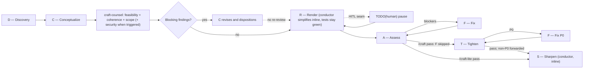
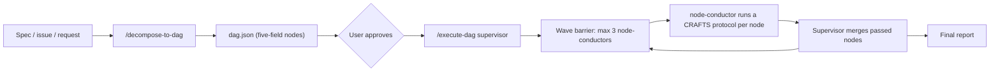

# CRAFTS

A personal-first, distributable CRAFTS toolkit for AI coding agents. It mirrors the current global `~/.agents` CRAFTS workflow and its role agents, including bundled security review guidance — plus a DAG layer (`/decompose-to-dag`, `/execute-dag`, and the `node-conductor` agent) that slices multi-node work into supervised CRAFTS runs.



## Contents

```text
skills/
├── craft/                    # Autonomous CRAFTS workflow
├── craft-hitl/               # CRAFTS with a TODO(human) Render seam
├── craft-lite/               # CRAFTS without T
├── decompose-to-dag/         # Spec → validated dag.json artifact
├── execute-dag/              # Supervised DAG execution (wave barrier)
└── guided-tour/              # One-concept-at-a-time codebase teaching

agents/
├── craft-planner.md          # C — Conceptualize
├── craft-counsel.md          # Plan counsel: feasibility, coherence, scope (+ security when triggered)
├── craft-builder.md          # R/F — Render and Fix
├── craft-code-simplifier.md  # Standalone simplify pass (not spawned by CRAFTS — Render does this inline)
├── craft-evaluator.md        # A — Assess
├── craft-security-review.md  # T — Tighten final-diff review (P0 gate)
└── node-conductor.md         # Conducts one DAG node through a CRAFTS protocol

tooling/                      # Metrics, mutation, Discovery, routing
├── bin/craft-discover.mjs    # Deterministic evidence packet
├── bin/craft-delta.mjs       # Post-Render change artifact
├── bin/craft-routes.mjs      # Pi role fallback installer
├── bin/craft-metrics.mjs     # Phase-grained collector
├── extensions/pi.ts          # Pi host adapter
├── extensions/claude-code.ts # Claude Code host adapter (hooks)
└── package.json

bin/link-global               # Author-machine live install
CHANGELOG.md                  # Protocol and toolkit history
```

## CRAFTS at a glance

CRAFTS is a sequential delivery workflow:

`D → C → counsel → R → A → [F] → T → S`

| Phase | Role | Purpose |
| --- | --- | --- |
| **D**iscovery | `craft-discover` (conductor, no spawn) | Read-only evidence packet: authority, task sources, graph freshness; no planning or scope |
| **C**onceptualize | `craft-planner` | Scope, acceptance criteria, tests, plan, and security triggers |
| *Plan counsel* | `craft-counsel` (single reviewer, different model family from C) | Independent one-pass review of the C plan before Render: feasibility, coherence, scope, and security when triggered |
| **R**ender | `craft-builder` | Test-first implementation, a required inline simplify pass (conductor, no spawn), and a decision record of choices the plan did not dictate |
| **A**ssess | `craft-evaluator` (different model family from R, blinded) | Judges what an exit code cannot: do tests encode the criteria, were they weakened to pass, is the implementation sound |
| **F**ix | `craft-builder` | Minimal fixes for blocking findings. **Conditional** — skipped entirely when A passes clean |
| **T**ighten | `craft-security-review` (different model family from R) | Bundled final-diff security review; only P0 findings block |
| **S**harpen | conductor (inline, no spawn) | Durable documentation and process learning |

| Command | Path | When |
| --- | --- | --- |
| `/craft` | `D → C → counsel → R → A → [F] → T → S` | Default. No gate skipped or reordered. |
| `/craft-hitl` | Same as `/craft`, HITL Render | A `TODO(human)` seam is reserved. |
| `/craft-lite` | `D → C → R → A → [F] → S` | Plan counsel and Tighten are out of scope (prototype, spike). |

Protocol version **5**. Pass it verbatim at run start: `craft-metrics start --craft-version 5`. A missed bump mixes two workflows under one label.

Every protocol runs a required Render-exit simplify pass after tests go green (tests must stay green; unrecoverable simplify is reverted) — the conductor performs it directly, not as a separate agent spawn. `/craft-lite` skips plan counsel and Tighten and uses `--mode lite`, which the metrics store enforces by rejecting `counsel`/`T` phase entries under that mode.

### Discovery packet and Render delta

D runs `craft-discover` (conductor, no spawn). It writes an immutable YAML packet under the OS temporary directory: authority sources, hashed task sources, Graphify `graph_status` (`current` | `stale` | `unavailable`) with candidates only when current, verified facts with citations, and evidence gaps. Graphify is never rebuilt during a run. Secrets and identity metadata are rejected before publication. C does not start without that packet. A structured blocked result naming unresolved authority stops the run.

After R, `craft-delta --base <R_BASE>` records changed files, validation exit codes, and source locations without rerunning Discovery. A and T receive the delta **and** an instruction to inspect the final diff independently. F receives only the blocking-context slice of the packet.

### Phase terminals and health

Each advisory phase ends in exactly one structured shape: its report, or `blocked` naming the missing evidence or decision. No third outcome. Soft inspection warnings finalize from current evidence; they do not excuse skipping independent final-diff review.

The conductor awaits one terminal result (`subagent_wait` on Pi; Claude Code has no equivalent and must still await the Agent return). After a no-report turn/tool threshold it records one `craft-metrics intervene --kind finalization-request` without disabling inspection tools. Deadline exhaustion exits the phase with `--reason timeout` and a blocked-detail reference. Launch validation/parse/dispatch defects are `orchestration-failure` events: they do not enter a phase or consume its one retry. Timeout or model failure retries only the same role through host-configured `fallbackModels`.

### Plan counsel gate and security triggers

C emits `security_triggers` from a closed vocabulary (`trust-boundary-change`, `untrusted-input`, `authentication-authorization`, `secrets-sensitive-data`, `external-integration`, `file-command-execution`, `ci-deploy-permissions`, `tenant-isolation`) instead of a subjective risk score; an empty list means low-risk work.

Every task then runs the **plan counsel gate** between C and R:

1. The C report goes verbatim to `craft-counsel`, a single independent-model reviewer: feasibility, coherence, and scope always; security only when a trigger is declared.
2. Any blocking finding returns the report to C, which revises once and dispositions every blocking finding: `adopted` (with the plan change) or `rejected` (with rationale).
3. Render begins only when every blocking finding has a disposition — dispositions are the gate, not agreement. There is no counsel re-review round.
4. The feasibility lens reports `probe_required` instead of guessing when an assumption needs execution to settle; the user supplies evidence, descopes, or confirms.
5. Counsel findings and dispositions forward to Assess, which treats thin rejections or cosmetic adoptions as blocking findings.

Tighten maps every declared trust boundary to evidence, a P0 finding, or explicit non-applicability. It returns only P0 findings as blockers; the conductor selects the project's existing memory sink for all non-P0 findings and records them directly during Sharpen — no separate agent. Security agents carry bundled review guidance with no external skill dependency. Role reports require named semantic fields; JSON is optional unless the host enforces a schema.

## DAG workflow

A single CRAFTS run stays in one session. When a spec slices into several independently verifiable outcomes, decompose first and execute as a supervised DAG:



### `/decompose-to-dag`

Turns a spec, issue, or free-form request into a validated `dag.json` written next to the work. Each node has exactly five fields — `id`, `intent`, `change_spec`, `acceptance_criteria`, `depends_on` — and one independently verifiable outcome; `depends_on` exists only where a node literally cannot be built or verified without another's output. Material uncertainty becomes a probe node whose criteria demand a durable, mergeable artifact, never a report. The skill validates the graph (unique ids, acyclic, testable criteria, no bundled outcomes, no intent smells) and runs an adversarial review pass before presenting a summary table. It stops at the artifact — implementation belongs to `/execute-dag`, and only after the user approves the DAG.

### `/execute-dag`

Executes an approved `dag.json` as the supervisor: it owns dispatch, merging, and reporting, and never implements node work itself.

```text
/execute-dag [--merge auto|hitl] [--protocol craft|craft-hitl|craft-lite] [dag.json]
```

- `--merge auto` (default): after a wave is terminal, merge passed nodes sequentially into the base branch, clean up their worktrees, then open the next wave.
- `--merge hitl`: present a per-node review table (status, branch, worktree path, diffstat, evidence) and stop; nothing merges and no worktree is removed without explicit approval.
- `--protocol` passes through to every node-conductor. Default `craft`; use `craft-hitl` only when nodes actually have `TODO(human)` seams; `craft-lite` skips Tighten.

Node tasks are written as packets under the OS temporary directory and launched from the static script `tooling/src/dag-workflow.static.js`. Arbitrary node text never becomes JavaScript source. Every execution attempt runs `subagent action: validate` on that exact script first; a failed validation records orchestration failure and dispatches nothing.

Dispatch is a **wave barrier**: a node is ready when every dependency is passed *and merged*; at most 3 node-conductors run per wave; the next wave opens only after the current one is terminal and its approved passed nodes are merged. Each node gets a supervisor-created Git worktree (`<repo>/tmp/worktree-<id>`, branch `dag/<id>`) — never a runtime-managed disposable worktree — so failed nodes stay browsable for diagnosis. An integration conflict gets exactly one re-derivation (`-attempt-2`); a failed or blocked node freezes its transitive dependents in both merge modes.

### `node-conductor`

The `node-conductor` agent conducts exactly one DAG node end-to-end. It loads the named protocol skill (`craft`, `craft-hitl`, or `craft-lite`), runs Discovery before C, spawns each directed phase agent sequentially, awaits one terminal result per phase, executes the implementation itself in its worktree — performing the required R-exit simplify pass and Sharpen directly, never as a spawn — and commits with the node id prefix (`[n3] ...`). Advisory roles receive packet slices, not the whole packet; A and T also get the Render delta. Fanout is depth 2: the supervisor launches only node-conductors, and a conductor launches only protocol phase agents. Dependencies arrive as already-merged code in the worktree, never as transcripts or sibling payloads. `craft-lite` nodes never spawn `craft-counsel` or `craft-security-review`.

## Installation

### Author-machine live install

The canonical daily-development setup uses symlinks, so global agents, skills, commands, and the Pi extension all resolve to this checkout:

```bash
~/Projects/crafts/bin/link-global
```

Pass `--skip-pi` when Pi is not installed or its extension is configured separately. Edits through these links change this repository; commit here.

Claude Code is the exception to "everything is a symlink". Its agent files are **generated** from `agents/*.md` into `~/.claude/agents/`, because the source files are written in Pi's frontmatter dialect (lowercase tool names, `input_schema`) — and two hand-maintained copies of an agent prompt drift, invisibly, until a reviewer behaves differently on one host than the other. `link-global` also registers the metrics hooks in `~/.claude/settings.json`, merging into whatever is already there and backing the file up first. Claude Code reads hooks at startup, so restart any open session.

### Manual/project install

Copy the skills and agents into a project's `.agents/` folder:

```bash
cp -R skills/* /path/to/project/.agents/skills/
cp -R agents/* /path/to/project/.agents/agents/
```

The metrics and mutation commands live in `tooling/`, along with both host adapters: the Pi extension is installed with `pi install /path/to/crafts/tooling`, and the Claude Code adapter is a set of hooks registered with `tooling/bin/craft-hooks-install.mjs ~/.claude/settings.json`. Invoke `/craft`, `/craft-hitl`, or `/craft-lite`. `/execute-dag` requires a subagent runtime with scripted orchestration (Pi's `workflowScript`/`runs.run`).

## Model routing

Agent frontmatter intentionally sets **no `model`** — with one deliberate exception, noted below — because in pi frontmatter outranks `agentOverrides`, so a baked-in value would shadow each host's routing. Route per host via `subagents.agentOverrides` (or your harness's equivalent). The intended tiering:

| Role | Tier | Author-machine pin |
| --- | --- | --- |
| C — planner | heavy | `openai-codex/gpt-5.6-sol` |
| Counsel — `craft-counsel` | medium, different family from planner | `zai/glm-5.3` |
| R/F — builder (incl. inline simplify) | medium, different family from evaluator | `zai/glm-5.2` |
| A — evaluator | heavy, different family from builder | `xai/grok-4.6` |
| T — tighten | medium, different family from builder | `openai-codex/gpt-5.6-terra` |
| S — sharpen (conductor, inline) | inherits the conductor's model — no separate tier | — |
| DAG — `node-conductor` | medium, pinned (see below) | `openai-codex/gpt-5.6-terra` |

`node-conductor` is the one deliberate exception to that rule: its frontmatter pins `openai-codex/gpt-5.6-terra` so every DAG node gets the same conductor regardless of host overrides — it is a node's sole orchestrator and sole writer, not an advisory lens a host should re-tier per phase.

Give every pin a `fallbackModels` chain (rate-limit and overload errors walk it automatically); keeping subscription-capped providers out of primary positions and fallback-only models in the chain degrades gracefully instead of failing the phase. Configured fallbacks retry the **same role** on provider or model timeout/failure. Conductors must not pick an ad hoc replacement model.

Install the Pi role routes with `craft-routes --host pi --settings ~/.pi/agent/settings.json`. The helper merges into `subagents.agentOverrides`, preserves valid user-supplied routes and unrelated settings, and refuses overlapping families at C→counsel, R→A, and R→T. Claude Code is unsupported and fails explicitly rather than inventing routing.

## Design principles

- **Acceptance criteria remain the reference.** Assess reviews the test suite against the canonical criteria—provided verbatim or C-authored when absent—not just passing tests.
- **A diff shows what changed, never why.** Render records the choices the plan did not dictate — alternatives weighed, assumptions made, approaches abandoned — each marked for whether it deviated from the plan. Without it, an edge case skipped because the plan scoped it out is indistinguishable from one skipped because it was awkward. Assess receives that record rather than the Render transcript: a transcript is mostly authorship signal and re-derivable detail, and it is the most expensive thing that could be put in front of the priciest phase.
- **Verification is an exit code, not a claim.** The repository's declared verify command is recorded with its real exit code (`craft-metrics verify`), and the store refuses an A `pass` verdict while that result is red. Reviewers never re-adjudicate whether the tree is green; they judge whether the tests deserve to be trusted. In DAG runs the supervisor re-verifies the base branch after each merge, so nodes that pass alone but break together surface as integration failures.
- **Independent review reduces correlated blind spots.** Builders do not approve their own work; plan counsel challenges the plan before code exists, and elevated plan review is independent of planning and implementation.
- **Adversarial reviewers judge blind.** A and T run on a different model family *and* receive payloads stripped of authorship — agent names, model ids, and DAG node/branch identity. Different-family routing removes same-model self-preference; blinding removes the larger effect, where naming an author shifts the verdict on identical code. The pi extension scrubs leaks at the `tool_call` boundary and records the count, so blinding is enforced rather than merely instructed.
- **Security starts in planning.** Threat boundaries and abuse cases are considered before code exists, then rechecked against the final diff.
- **Knowledge compounds.** Sharpen records durable lessons without turning ordinary fixes into documentation churn.
- **Humans own consequential judgment.** HITL reserves explicit seams for people while the agent handles surrounding implementation and verification.
- **Phases terminate.** A gate produces a report, a blocked result, or a recorded timeout. Indefinite inspection is a defect; so is a launch failure counted as a phase retry.

## License

MIT
